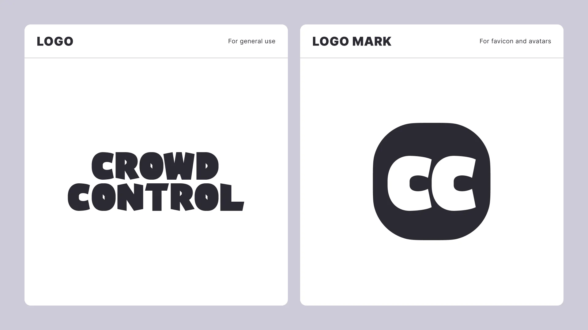
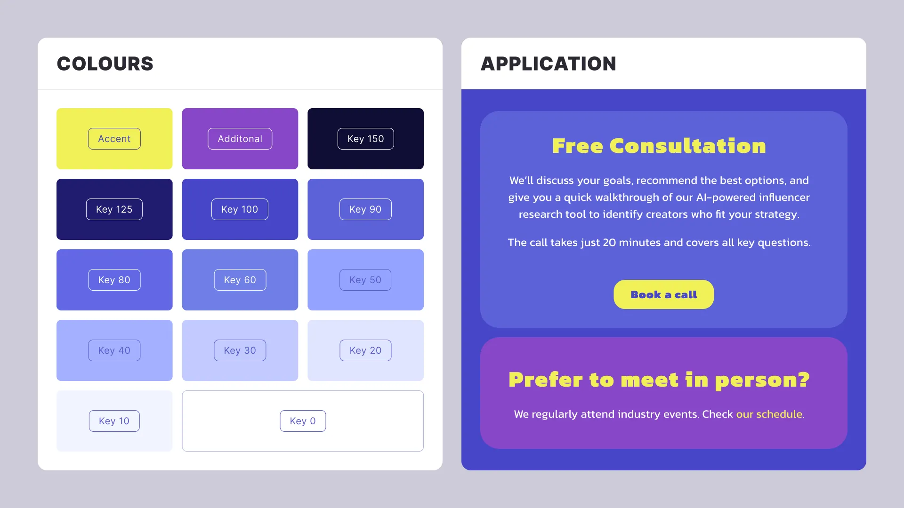
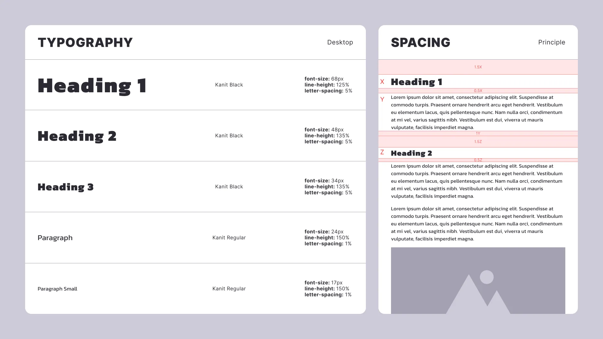
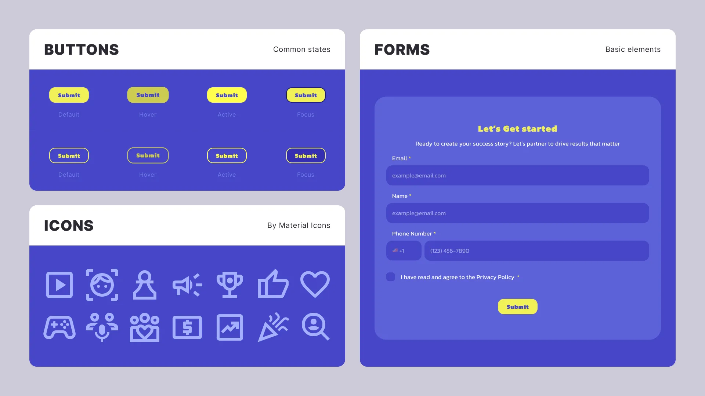
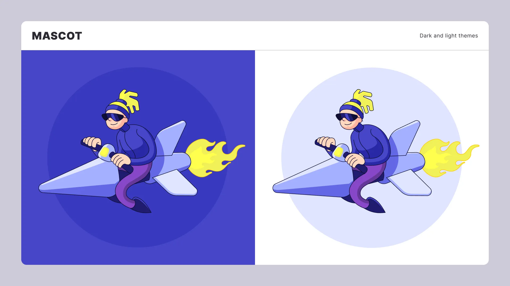
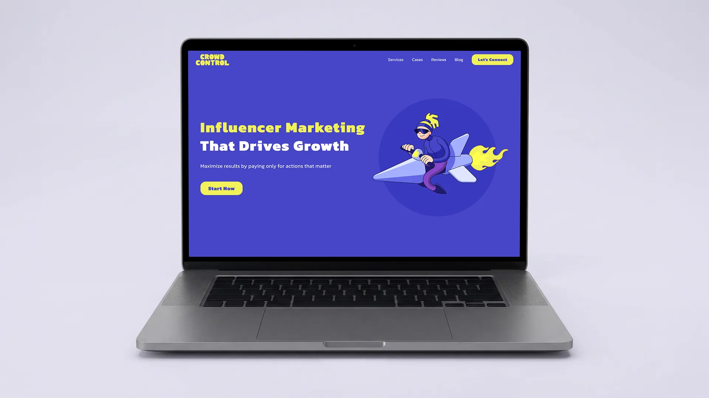

## Problem Statement

Crowd Control had no established visual identity and needed to build one from scratch before launching active digital marketing initiatives. Generic design templates, however, did not reflect the energetic character of the service.

## My Role

My role was to create a visual identity from scratch and apply it to the brand’s primary touchpoint: its landing page. I designed the logo and logo mark, selected the typeface and colour palette, developed the design system and landing page, and illustrated the brand mascot, Booster.

## Logo

The logo uses bold typography inspired by the Passion One typeface. I rebuilt and optimised the lettering for a 32-pixel grid so that its distinctive character would remain clear and consistent across different sizes and placements.

To support the wider visual direction, I gave the logo a playful character that complements the bright colours and cartoon-style illustrations.

Because the Crowd Control name is relatively long, I also created an abbreviated version that fits naturally within a square. It can be used efficiently across compact touchpoints such as social media avatars and website favicons.

## Colours

I developed a bright and flexible colour system to support the cartoon-inspired visual style. Each composition uses one dominant colour, with its shades applied throughout the design and the main tone typically used as the background.

To create strong contrast, I introduced a complementary colour for headings and primary accents. An additional supporting colour is used for secondary highlights and smaller details that need to remain visible without becoming the main focus.

## Typography

The typography system is built around Kanit, whose playful letterforms complement the logo while remaining suitable for longer sections of text. I used only two weights: Regular for body copy and Black for headings.

I also adjusted the letter spacing, as the typeface was primarily intended to appear on dark backgrounds, which reduced its natural readability. Slightly wider spacing made the text clearer while preserving its distinctive character.

## UI Components

I developed a set of reusable components for the landing page, including buttons, cards, sliders, forms, and the website header. The components use relatively simple patterns, but together they cover the main requirements of a marketing website.

We decided not to create a custom icon set because Google Material Icons complemented the visual identity surprisingly well. The image below shows part of the resulting component system.

## Mascot

Together with the Crowd Control team, I developed a mascot named Booster: a young rider on a vehicle that combines the characteristics of a space rocket and a motorbike.

I gave the character a soft, rounded appearance designed to feel approachable and humorous. His unusual silhouette and vivid colours immediately attract attention, helping the brand interrupt scrolling and become more memorable.

## Landing Page

Finally, I designed the landing page. Because the Crowd Control team planned to scale the brand further, they preferred to use familiar and proven layout patterns. The mascot, colour system, and typography gave these established structures a fresh and distinctive character.

## Conclusion

This project demonstrates how a visual identity can be built from scratch with enough structure to communicate effectively in a B2B environment, while retaining enough boldness and approachability to stand apart in a crowded market.

In an attention-driven digital environment, the project shows how startups and midsized businesses can establish a recognisable voice and use it to connect with their audience.