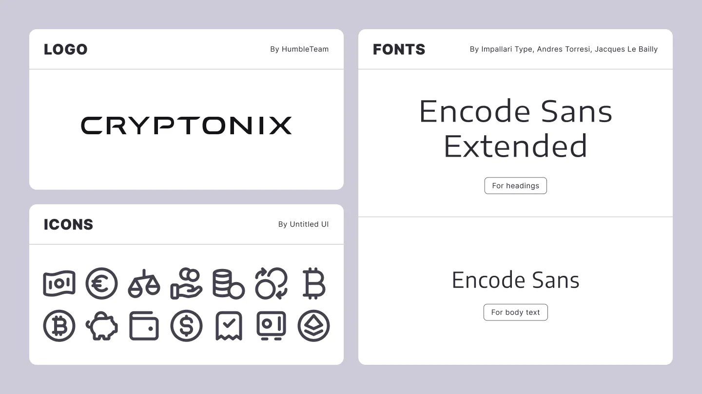
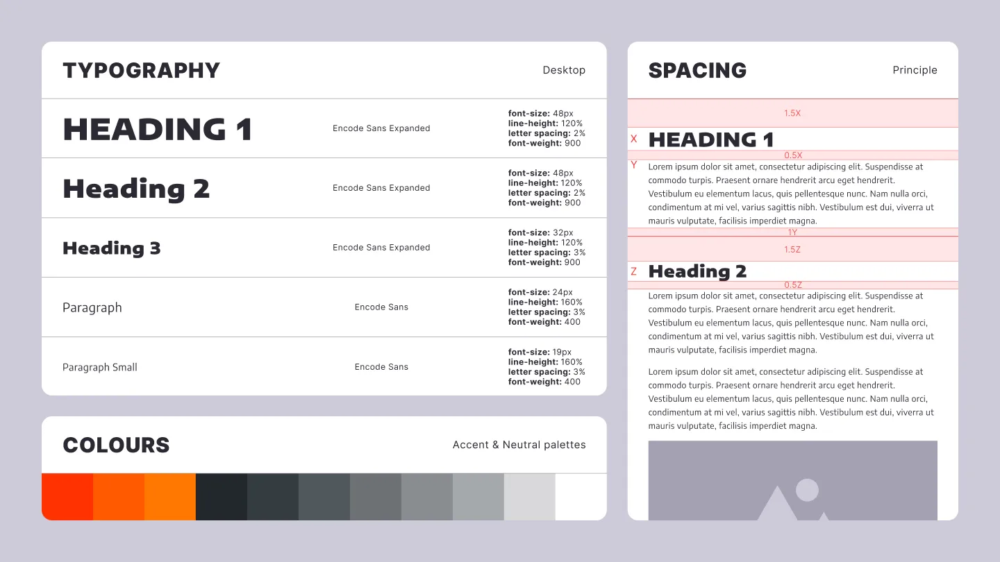
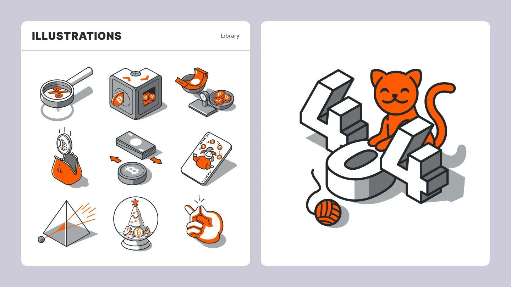
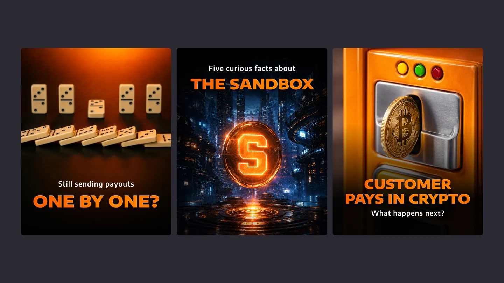
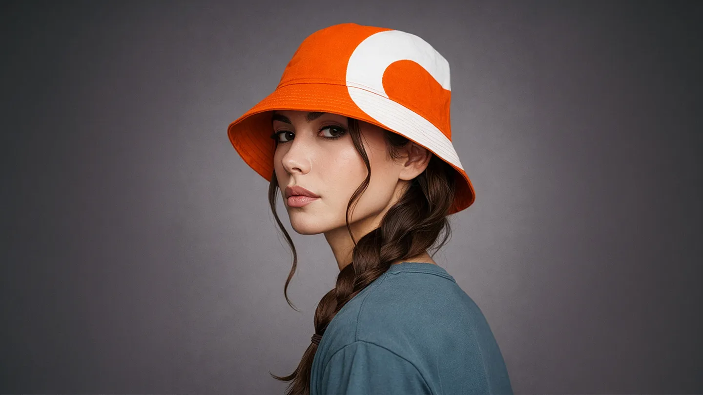
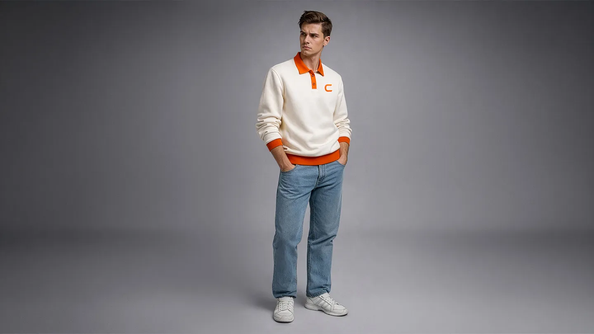
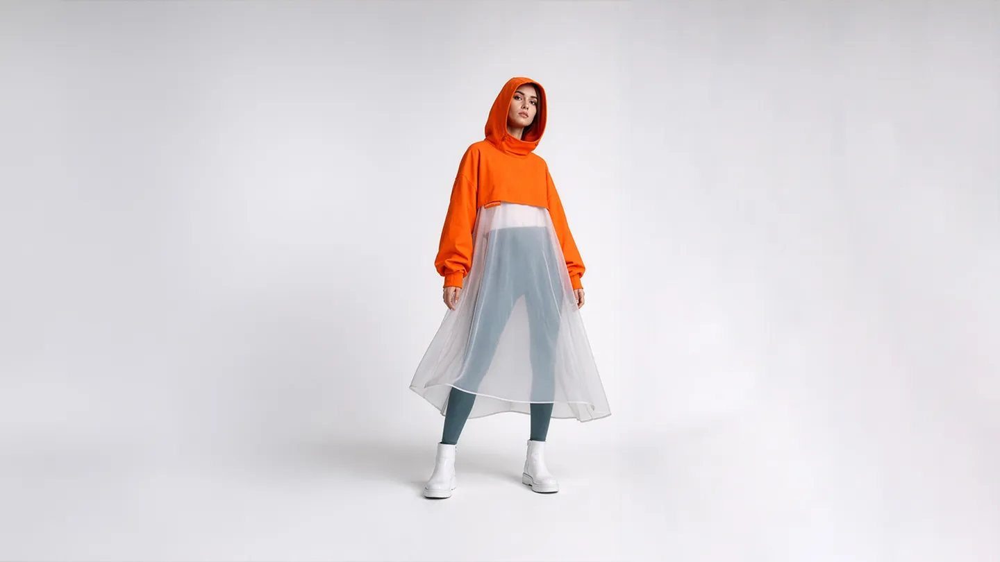
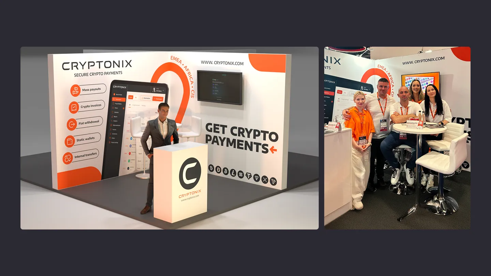

## Problem Statement
Many fintech and crypto payment brands rely on a similar visual language, particularly blue accent colours and neutral grotesque typefaces. Cryptonix needed to differentiate itself from competitors while maintaining the credibility expected by a corporate B2B audience.

## My role
My role was to develop a distinctive brand identity and scale it across the company’s key touchpoints, including the website, newsletters, pitch decks, social media, merchandise, and exhibition stands.

## Prerequisites and resources
The identity was developed using the existing Cryptonix logo, a typeface selected from Google Fonts, and the Untitled icon library. My role was to combine these elements into a coherent visual system and define how they should be applied across different brand touchpoints.

## Design System
I built the design system around colour and typography. Because blue is heavily overused by competitors, I chose a contrasting direction based on orange as the primary accent colour, supported by a neutral palette of grey tones.

I then defined the core principles for typographic hierarchy, spacing, and layout. The system is based on the body-text size, which determines the proportions and spacing of surrounding elements. This approach prioritises readability and provides a clear set of rules that can be applied consistently across both digital and physical formats.

## Illustrations
To support the website and newsletters, which required clean, scalable, and minimal visuals, I created a library of semi-isometric illustrations using the brand colours and a consistent stroke style.

This visual approach was selected for its ability to communicate complex and often abstract concepts through metaphor and exaggeration. It also allowed individual illustration elements to be reused and recombined, making the library easier to expand as new content requirements emerged.

## Social Media Visuals
Cryptonix’s social media content relied heavily on carousels and static posts. However, blockchain and cryptocurrency are highly abstract subjects, and conventional stock photography offered limited opportunities for relevant visual communication. To address this, I proposed using AI-generated graphics supported by a set of prompt-engineering guidelines.

A key requirement for maintaining brand consistency was ensuring that orange remained visually dominant within each composition. This was achieved either by making a central object orange or by introducing vivid orange lighting into the scene. Both approaches proved flexible enough to support a wide range of subjects.

To strengthen brand recognition further, I developed a title treatment combining rim lighting with a soft gradient. This created greater contrast and helped headlines stand out while users scrolled through their feeds.

## Swag
Because the company regularly attended exhibitions and industry events, it needed branded merchandise that could be presented to prospects and partners. I created a collection of premium items with considered cuts, restrained detailing, and minimal printing.

The objective was to reinforce the company’s credibility while keeping the merchandise contemporary, distinctive, and suitable for professional industry events.

## Exhibitions
Another important brand application was the exhibition stand. The concept was developed around the dimensions, available equipment, and practical requirements of the events Cryptonix planned to attend.

As a result, the design was not intended primarily as an exploration of stylistic possibilities. It addressed a specific communication problem: presenting the company’s marketing message clearly within a crowded environment while providing enough functional space for employees and visitors.

## Conclusion
This project demonstrates how an in-house brand designer can extend an identity beyond its basic elements, apply it consistently across digital and physical touchpoints, and establish a foundation for future brand development.

Alongside the development of the identity, we produced approximately one hundred social media carousels and posts, launched multiple newsletter campaigns and website pages, and created tailored presentations for more than ten industries. The brand system made these materials more consistent, recognisable, and efficient to produce.