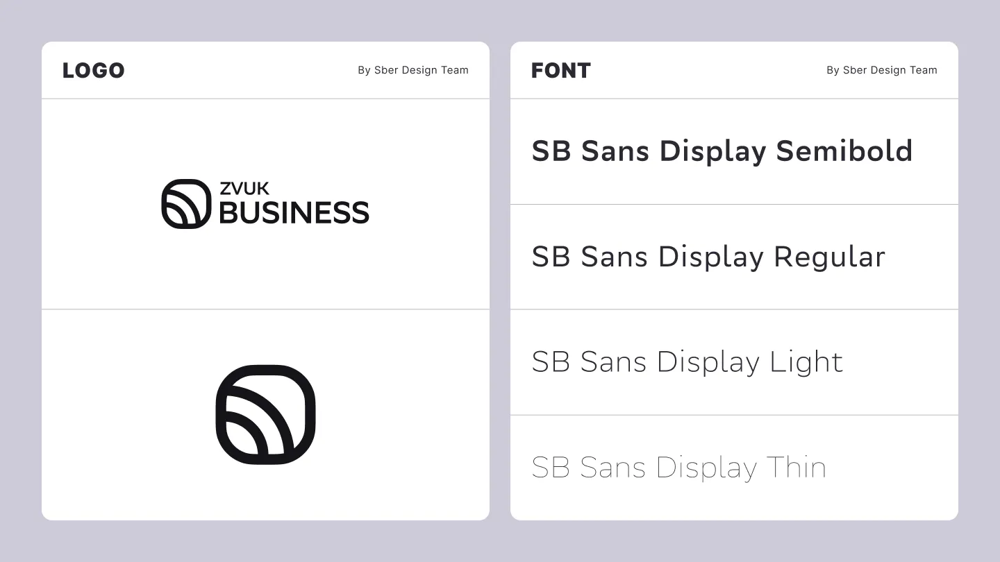
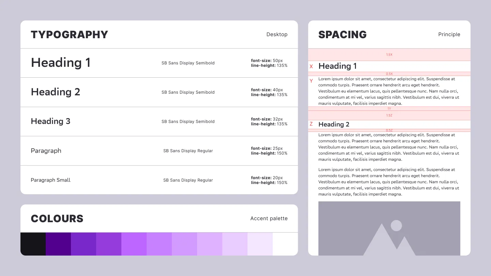
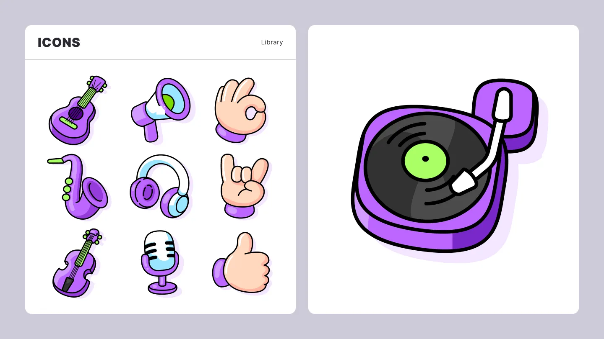
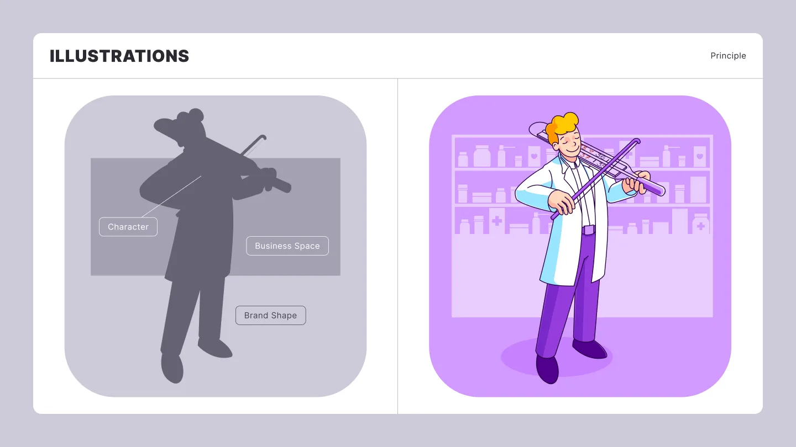
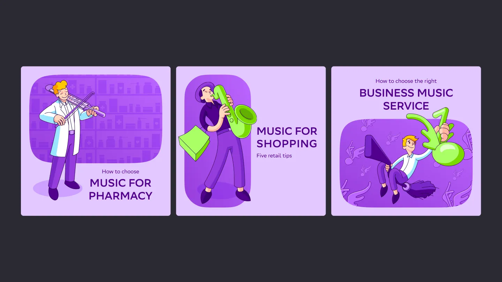

## Problem Statement

Zvuk Business inherited several brand elements from its parent brand, Zvuk, but lacked a design system capable of supporting its day-to-day communication needs.

## My role

My role was to build a practical design system around the inherited assets and apply it across key company touchpoints, including social media, presentations, and the website.

## Prerequisites and resources

The inherited assets included the SB Sans Display typeface in several styles, the Zvuk Business logo, and a brand pictogram.

## Design System

I built the design system around colour and typography.

Violet was selected from four colour directions provided by the parent brand. I then defined the exact tone and developed a broader palette suited to the company’s communication needs.

I also established the core principles for typographic hierarchy, spacing, and layout. The system is based on the body-text size, which determines the proportions and spacing of surrounding elements. This approach prioritises readability and provides a clear set of rules that can be applied consistently across both digital and physical formats.

## Icons

To support the website and presentations, which frequently required compact visual explanations, I created a library of colourful, cartoon-style icons.

This approach made it possible to communicate complex and abstract concepts through metaphor and exaggeration. The playful style also helped the brand attract attention in a B2B environment where visual communication is often highly restrained. As a music service, Zvuk Business could afford to feel more expressive and approachable than many other B2B brands.

## Illustrations

Zvuk Business used social media primarily to publish educational content about how music influences customer behaviour.

Because the content covered different industries and types of influence, I developed a consistent structure for the illustrations. A typical composition included a character representing a customer, employee, or business owner; a background element connected to the industry or topic; and a rounded shape derived from the Zvuk pictogram.

This framework maintained a recognisable visual language while leaving enough flexibility for different topics, scenarios, and creative interpretations.

## Social Media Visuals

A typical social media visual combined an illustration with a title and subtitle. Titles used an uppercase semibold style, while subtitles used the regular typeface.

The bright brand palette was extended with a contrasting green accent, helping the visuals stand out in social media feeds. Variations of the brand shape introduced enough diversity to keep the feed visually engaging while preserving overall consistency and recognition.

## Conclusion

This project demonstrates how an in-house brand designer can develop a versatile visual language from a limited set of existing assets, remain aligned with a broader brand ecosystem, and address practical communication needs.

Using this visual toolkit, we produced hundreds of social media posts, more than 200 presentations for prospective clients, and dozens of landing pages. In addition to creating a recognisable brand identity, the system reduced reliance on stock imagery and lowered the cost of producing custom visual assets.